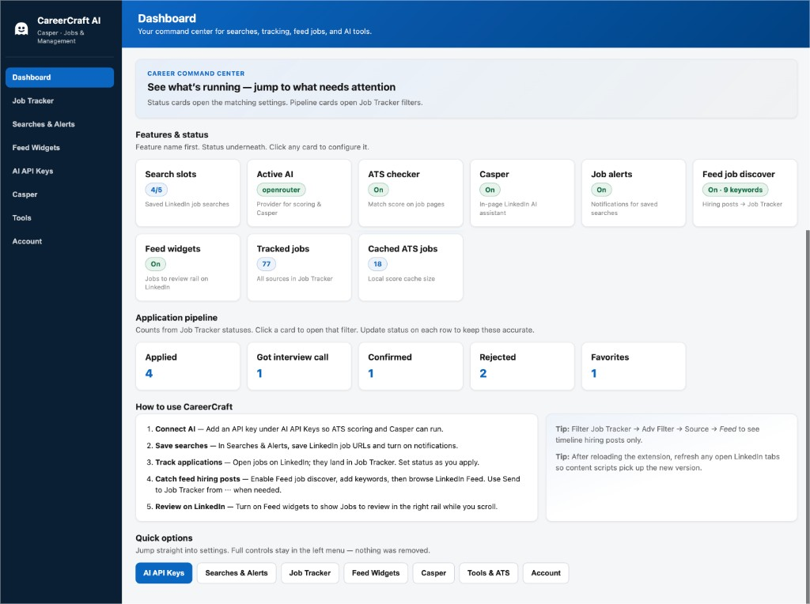
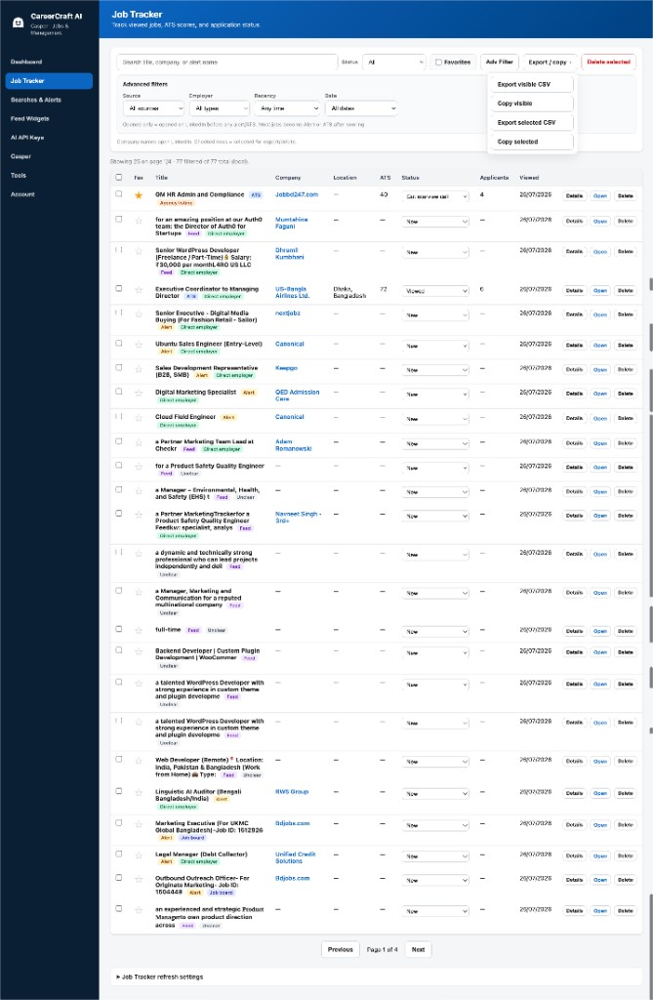
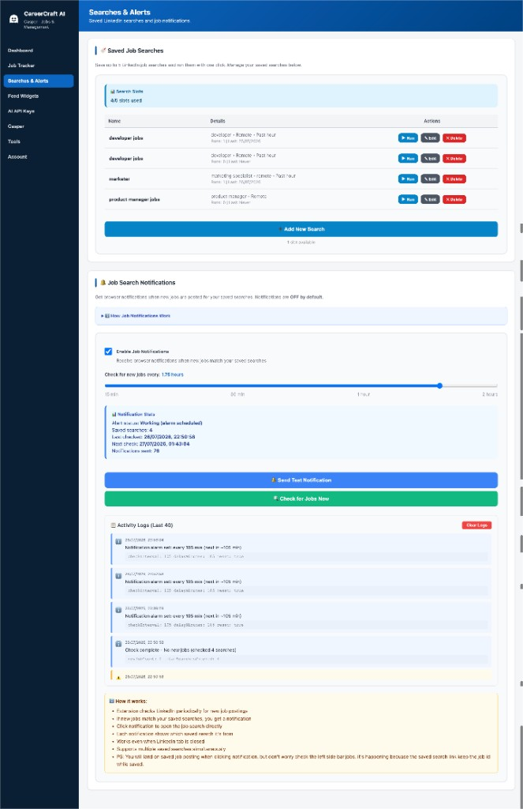
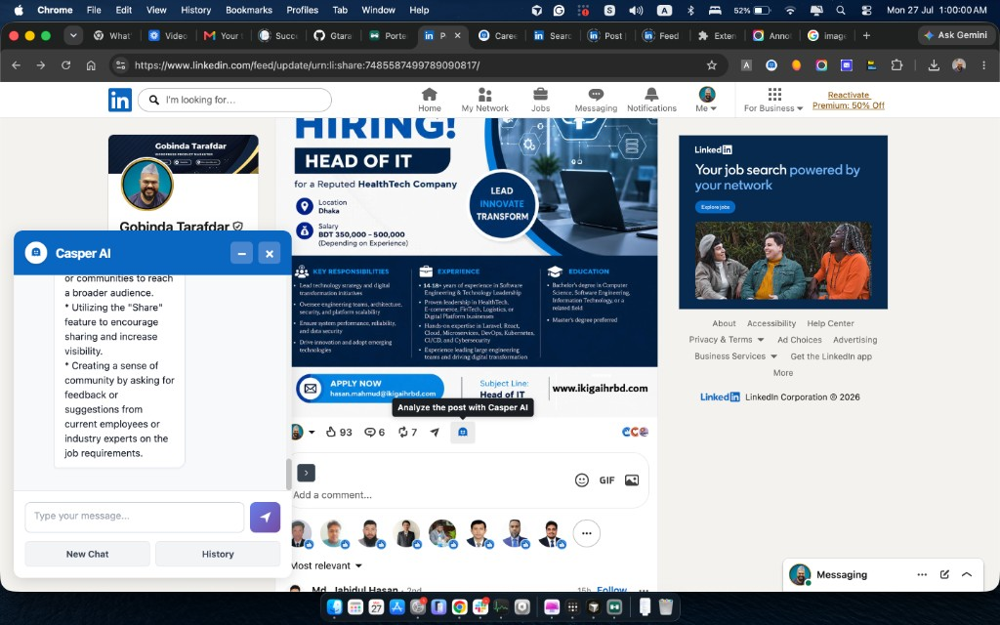
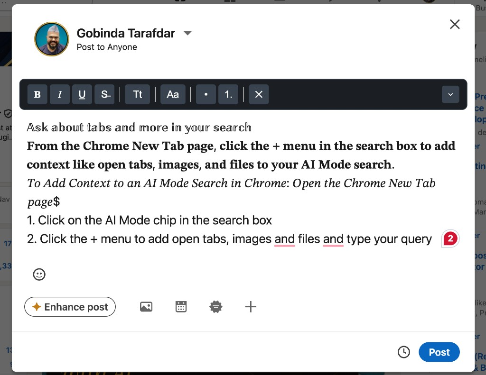
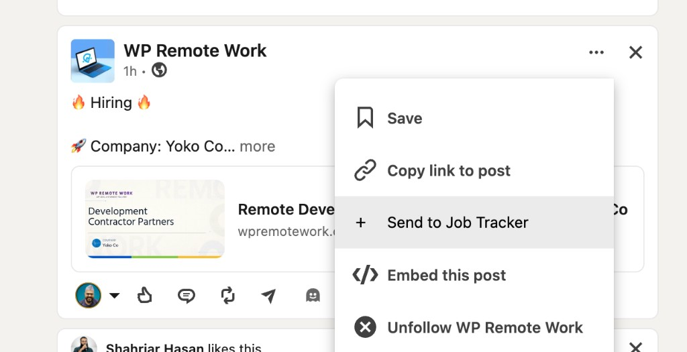

# CareerCraft AI

**LinkedIn career assistant for Chrome** — Job Tracker, ATS scoring, Casper AI post analysis, saved-search alerts, last-1-hour jobs, feed discovery, saved-items filters, post formatting, and clipboard image paste. Your API keys stay on your device.

🌐 **Product site:** [gtarafdar.github.io/careercraft-casper-ai-for-linkedin-jobs-and-management](https://gtarafdar.github.io/careercraft-casper-ai-for-linkedin-jobs-and-management/)

  <a href="https://github.com/Gtarafdar/careercraft-casper-ai-for-linkedin-jobs-and-management/releases/download/v2.7.1/careercraft-ai-2.7.1.zip"><strong>⬇ Download ZIP (v2.7.1)</strong></a>
  ·
  <a href="https://github.com/Gtarafdar/careercraft-casper-ai-for-linkedin-jobs-and-management/stargazers"><strong>★ Star</strong></a>
  ·
  <a href="https://gtarafdar.com/donate"><strong>Donate</strong></a>
  ·
  <a href="https://www.linkedin.com/in/gtarafdar/"><strong>Connect</strong></a>

  

---

## Why CareerCraft

LinkedIn is where the jobs are — but your process is still scattered across tabs, notes, and AI dashboards that want your keys on their servers.

CareerCraft keeps the hunt **on LinkedIn**: write better posts, catch fresher jobs, track applications, score fit with **your** profile + **your** provider, analyze posts with Casper, and filter saved items — without a CareerCraft cloud.

---

## Install (2 minutes)

1. **[Download careercraft-ai-2.7.1.zip](https://github.com/Gtarafdar/careercraft-casper-ai-for-linkedin-jobs-and-management/releases/download/v2.7.1/careercraft-ai-2.7.1.zip)** (or the [latest release](https://github.com/Gtarafdar/careercraft-casper-ai-for-linkedin-jobs-and-management/releases/latest))
2. Unzip the folder
3. Open `chrome://extensions` → enable **Developer mode** → **Load unpacked** → select the folder
4. Pin **CareerCraft AI**, open the dashboard, optionally add an AI key + profile for ATS / Casper

---

## Product screenshots

| Dashboard | Job Tracker |
| --- | --- |
|  |  |

| Searches & Alerts | Casper on LinkedIn |
| --- | --- |
|  |  |

| Post formatter | Last 1 hour / save search |
| --- | --- |
|  |  |

More (feed rail, favorite authors, saved-posts filters, AI keys, popup): see the [product gallery on the site](https://gtarafdar.github.io/careercraft-casper-ai-for-linkedin-jobs-and-management/#product).

---

## Features

### Job Tracker (your local job board)
- Status pipeline: New → Viewed → Applied → Interview → Confirmed / Rejected / Expired / Archived
- ATS score column, favorites, applicants, company, dates
- Filters: status, source (ATS / alerts / feed / job board), employer kind, recency, date
- Export / copy visible or selected CSV · bulk delete
- Soft-ingest from ATS views, alerts, and feed discovery

### ATS scoring
- Compatibility % vs your CV / LinkedIn profile (skills, experience, education, keywords, responsibilities)
- Strengths, gaps, requirements breakdown
- Local ATS cache to save API spend

### Casper AI — post analysis & chat
- Ghost icon on LinkedIn posts for quick analysis and reply angles
- Floating chat for strategy and outreach help
- Opt-in; chat history with retention controls

### Searches, alerts & freshness
- Save up to **5** LinkedIn job searches
- Desktop notifications when a search’s **job count goes up** (not every quiet check)
- **Last 1 hour** pill on Jobs search + popup shortcut
- Activity log, test notification, check-now

### Feed & discovery
- **Jobs to review** right-rail card (alerts + tracker + feed candidates)
- **Favorite authors** rail (up to 5 profiles)
- **Timeline job discovery** with keyword match → Job Tracker
- **Send to Job Tracker** in the post ⋯ menu

### Writing & saved items
- Unicode post / comment formatter (bold, italic, lists, colors, case)
- Clipboard image paste into compose
- Extra filters on LinkedIn **Saved posts** (All / Posts / Images / Videos / Articles)

### AI & settings
- Providers: Gemini, OpenAI, OpenRouter, DeepSeek, Qwen — keys local
- Profile upload / paste / auto-extract for ATS
- Dashboard command center + Chrome popup controls

**Not included (on purpose):** bulk people scrape, auto-apply bots, CareerCraft cloud for your tracker.

---

## Quick start on LinkedIn

1. **Format** — Create post / comment → CareerCraft toolbar  
2. **Paste image** — Copy screenshot → paste into composer  
3. **Save search** — Jobs search → Save Current Search → enable alerts  
4. **Last 1 hour** — Use the Last 1 hour control for freshest roles  
5. **Track** — Open jobs (ATS) or ⋯ → Send to Job Tracker  
6. **Casper** — Click the ghost on any post  
7. **Saved items** — Open My Items → use CareerCraft filter chips  

---

## Privacy

- API keys → Chrome extension storage on your machine  
- AI requests → **your** provider only (no CareerCraft proxy)  
- Tracker / profile / chats → local  

See [PRIVACY.md](PRIVACY.md).

---

## About the maker

**Gobinda Tarafdar** — Product Marketing Specialist at [WPBakery](https://wpbakery.com/). Builds local-first tools when the day-job owl flies home.

- GitHub: [Gtarafdar](https://github.com/Gtarafdar)  
- LinkedIn: [gtarafdar](https://www.linkedin.com/in/gtarafdar/)  
- Donate: [gtarafdar.com/donate](https://gtarafdar.com/donate)  
- Workshop hub: [Porter site](https://gtarafdar.github.io/porter/)

### Also from the workshop

| Tool | What it is |
|------|------------|
| [Porter](https://gtarafdar.github.io/porter/) | Private Finder-like file bridge across your Macs · MCP |
| [Aligner](https://gtarafdar.github.io/aligner/) | Chrome toolkit for design, measure, WordPress |
| [FinderFlow](https://gtarafdar.github.io/FinderFlow/) | Native macOS file manager + editor |
| [Slack Agent Bridge](https://gtarafdar.github.io/slack-agent-bridge/) | MCP bridge for Cursor/Claude → Slack |
| [Auto AFK Slack](https://gtarafdar.github.io/auto-afk-slack/) | Lock Mac → Slack AFK |
| [Slack Teammate Time](https://gtarafdar.github.io/slack-teammate-local-time/) | Local times inline in Slack |
| [Broken Link Checker](https://gtarafdar.github.io/broken-link-checker/) | Find broken links in-page |

---

## Support the project

If CareerCraft saves you time:

1. **[★ Star this repo](https://github.com/Gtarafdar/careercraft-casper-ai-for-linkedin-jobs-and-management)**  
2. **[Donate](https://gtarafdar.com/donate)**  
3. **[Connect on LinkedIn](https://www.linkedin.com/in/gtarafdar/)**  

---

## Development

Load the **repo root** as an unpacked extension in Chrome. Edit `content/`, background, options UI as needed, then reload the extension.

Landing page: [`docs/`](docs/) (GitHub Pages → `main` / `/docs`).

---

## License

See repository license if present. LinkedIn is a trademark of its respective owners; this project is not affiliated with LinkedIn.
